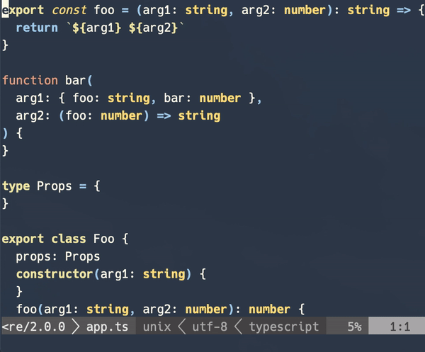

# jsdoc.vim


jsdoc.vim generates [JSDoc](http://usejsdoc.org/) block comments based on a function signature.



## Note

jsdoc.vim supports **Vim8**.

Neovim works since v2.1.0, but if something wrong, send me pull requests to fix it.

If you want use old version checkout [1.0.0](https://github.com/heavenshell/vim-jsdoc/releases/tag/1.0.0>).

## Install

### Vim Plug

```
Plug 'heavenshell/vim-jsdoc', { 
  \ 'for': ['javascript', 'javascript.jsx','typescript'], 
  \ 'do': 'make install'
\}
```

### Manual Installation

Since version 2.0.0, jsdoc.vim requires a local copy [lehre](https://www.npmjs.com/package/lehre) installed to the plugin directory.

You can install lehre with:

```console
# cd to <vim-jsdoc path>
make install
```

If you want to update `lehre` use:

```console
make clean
make install
```

If you want install lehre manually, you can install from npm.

```console
$ yarn add -D lehre
```

Set installed `/path/to/node_modules/.bin/lehre` path to `g:jsdoc_lehre_path`.

## Usage

1. Move cursor on `function` keyword line
1. Type `:JsDoc` to insert JSDoc
1. Insert JSDoc above the `function` keyword line

## Format

1. Type `:JsDocFormat`
1. Insert JSDoc above the all signatures

## Configuration

Option                     |Default       |Description
:--------------------------|:-------------|:-----------------------
**g:jsdoc_templates_path** |''            |Path to custom template.
**g:jsdoc_formatter**      |'jsdoc'       |Document block formatter, `jsdoc`, `esdoc`, `tsdoc`
**g:jsdoc_lehre_path**     |'./lib/lehre' |Path to [`lehre`](https://www.npmjs.com/package/lehre).

## Formatter

You can choose formatter from [JsDoc](https://jsdoc.app/), [ESDoc](https://esdoc.org/), [TSDoc](https://github.com/microsoft/tsdoc).

If you want to create your own template, see [example template](https://github.com/heavenshell/ts-lehre/tree/master/examples). 

## Intaractive input

Since ver 2.0.0 input `Allow prompt for interactive input` is deprecated.

If you want input Intaractively, use snippet plugin.

See [snippet example template](./examples/snippet_template.js).

## Keymap

You can add following setting to .vimrc
```vim
nmap <silent> <C-l> <Plug>(jsdoc)
```

Alternatively, you could add the following setting to your .vimrc to search for the last `function` declaration
and puts your jsdoc above it:
```vim
nmap <silent> <C-l> ?function<cr>:noh<cr><Plug>(jsdoc)
```

## Thanks
- This plugin based on https://gist.github.com/3903772#file-jsdoc-vim written by [NAKAMURA, Hisashi](https://gist.github.com/sunvisor)

- The idea of npm packages installation is from [vim-lsp-settings](https://github.com/mattn/vim-lsp-settings).
Highly applicate [@mattn](https://github.com/mattn/) and all vim-lsp-settings contributors.

## LICENSE
New BSD LICENSE
